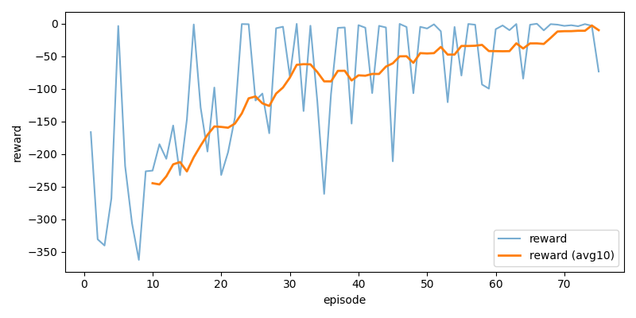
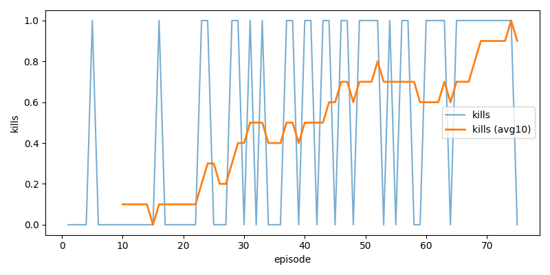
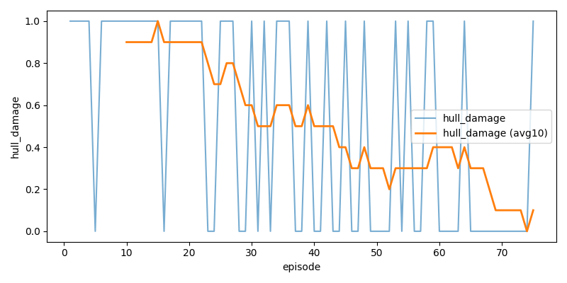
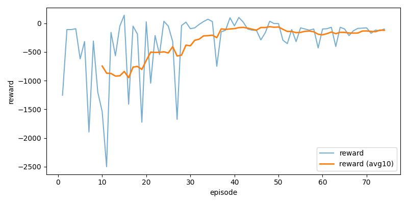
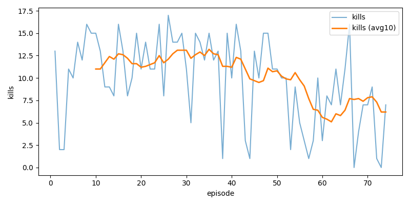
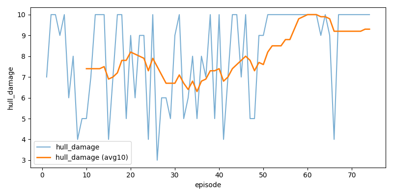

# SAC-ADS

**SAC-ADS** is a presentation-first reinforcement learning repository about defending a base from incoming asteroids with a turret.

The repository currently combines three control ideas around one custom `Gymnasium` environment:

- a **heuristic baseline** that analytically computes intercept points,
- a **continuous SAC aimer** trained on a single-target aiming problem,
- a **discrete SAC selector** that chooses which asteroid slot to engage in the full game.

At inference time, the learned system is a **two-stage agent**: the selector picks a target slot, and the frozen aimer produces the actual turret action `(yaw, pitch, fire)`.

In this repository, the word **slot** means one fixed asteroid position inside the observation tensor. A slot can be either occupied by an asteroid or empty. The selector always predicts a slot index, so choosing an empty slot is a meaningful failure case during training.

<p align="center">
  
</p>

<a id="table-of-contents"></a>

## Table of Contents

1. [Overview](#overview)
2. [Asteroid Defense Environment](#environment)
3. [Main Dependencies and Project Entry Points](#dependencies)
4. [Mathematics and Notation](#mathematics)
5. [Heuristic Baseline](#baseline)
6. [Continuous SAC Aimer](#aimer)
7. [Discrete SAC Selector](#selector)
8. [Two-Stage Agent](#two-stage-agent)
9. [Checked-In Artifacts and Metrics](#artifacts)
10. [Plot Gallery](#plot-gallery)
11. [Commands](#commands)
12. [Project Layout](#layout)
13. [Repository Notes and Caveats](#notes)
14. [References](#references)

<a id="overview"></a>

## Overview

SAC-ADS is a compact lab for experimenting with **hybrid control** in a turret-defense task. The project is built around one custom environment, but it studies that environment through multiple training views:

- a **single-target aiming problem** for low-level control,
- a **multi-target slot-selection problem** for high-level target choice,
- a **full evaluation setting** where the frozen low-level policy and learned high-level policy are combined.

### What the repository currently contains

| Track | Scope | Method | Main checked-in outputs |
| --- | --- | --- | --- |
| Baseline | Full multi-asteroid defense task | Analytic intercept controller | 2 GIFs, `results/baseline_metrics.txt` |
| Aimer | Single-target pretraining task | Continuous SAC | Actor and critics, 3 training plots |
| Selector | Multi-target target-selection task | Discrete SAC | Actor and critics, 3 training plots |
| Hybrid Agent | Full multi-asteroid defense task | Selector + frozen aimer | `important_gif/agent.gif`, `results/model_metrics.txt` |

### Core definitions used throughout the README

| Term | Definition |
| --- | --- |
| **Asteroid slot** | One fixed slot inside the observation tensor. Up to 5 slots are encoded in the full environment observation, and a slot may be empty. |
| **Kill** | A kill is counted when a projectile intersects an asteroid and removes it from the environment. |
| **Hull damage** | Hull damage counts how many asteroids reached the defense area or impact radius and damaged the base. |
| **Win rate** | Win rate is the fraction of evaluation episodes that end with positive HP and zero remaining asteroids. |
| **Selector observation** | The 29D observation used for target selection in the full task. |
| **Aimer observation** | The 7D observation formed from one selected slot plus current turret orientation. |
| **Baseline action** | The analytic turret command computed from the intercept geometry, used for evaluation and reference comparison. |
| **Two-stage agent** | The combined inference policy where the selector chooses a slot and the frozen aimer emits the real continuous action sent to the environment. |

### Current checked-in evaluation summary

The table below reports the metrics stored in the checked-in files under `results/`.

| Controller | Kills total | Hull damage total | Win rate | Source |
| --- | --- | --- | --- | --- |
| Heuristic baseline | `745` | `957` | `0.17` | `results/baseline_metrics.txt` |
| Learned two-stage agent | `1110` | `803` | `0.66` | `results/model_metrics.txt` |

<a id="environment"></a>

## Asteroid Defense Environment

The environment is implemented in [core/env.py](core/env.py). The turret sits at the origin, asteroids spawn above the defense area, and the agent must rotate and fire before they reach the base.

### What happens in one episode

- The environment spawns up to `max_asteroids` active asteroids at once.
- Each asteroid moves with randomized velocity toward the defense area.
- The turret updates `yaw` and `pitch` from the continuous action vector.
- If `fire_action > fire_threshold`, the environment emits a projectile along the current gun direction.
- Hits increase kills and grant `reward_hit`.
- Impacts reduce HP, increase hull damage, and add `reward_impact`.
- The episode ends when HP reaches zero, all asteroids are cleared, or `max_steps` is reached.

### Environment variants used in this repository

| Variant | Main config | Purpose | Active asteroids | HP | Observation | Action |
| --- | --- | --- | --- | --- | --- | --- |
| Aimer training | `configs/config_aim.yaml` | Learn low-level aiming and firing | `1` | `1` | `7D` | Continuous `Box(3)` |
| Selector training | `configs/config_select.yaml` | Learn which slot to commit to | Up to `5` | `10` | `29D` | Discrete slot index |
| Visual evaluation | `configs/config_eval.yaml` | Run baseline, manual, or hybrid agent | Up to `5` | `10` | `29D` | Continuous `Box(3)` |

### Full observation definition

The full environment observation has dimension `29`:

```text
5 asteroid slots x 5 features each = 25
+ hp_norm
+ remaining_norm
+ yaw_norm
+ pitch_norm
= 29
```

Each asteroid slot contributes:

| Feature | Definition |
| --- | --- |
| `err_yaw` | Normalized yaw error between the turret and the analytic intercept direction for that slot. |
| `err_pitch` | Normalized pitch error between the turret and the analytic intercept direction for that slot. |
| `time_norm` | Normalized intercept time estimate. |
| `dist_norm` | Normalized Euclidean distance to the asteroid. |
| `t_impact_norm` | Normalized time-to-impact estimate. |

If a slot is empty, the environment fills it with a padded placeholder vector.

### Environment action definition

The physical turret action is always a 3D continuous vector:

```math
a_t = (u^{yaw}_t, u^{pitch}_t, u^{fire}_t) \in [-1, 1]^3
```

| Component | Meaning |
| --- | --- |
| `u_yaw` | Angular velocity command for yaw. |
| `u_pitch` | Angular velocity command for pitch. |
| `u_fire` | Fire trigger; the environment shoots when this exceeds `fire_threshold`. |

<a id="dependencies"></a>

## Main Dependencies and Project Entry Points

### Main runtime dependencies

| Dependency | Role in the repository |
| --- | --- |
| `python` | Runtime for all scripts and training code |
| `torch` | Neural network training for the aimer and selector |
| `numpy` | Environment math, geometry, and observation processing |
| `gymnasium` | Environment API and `spaces.Box` definitions |
| `pygame` | 2D renderer for interactive runs |
| `ursina` | Optional 3D renderer for visual runs |
| `matplotlib` | Plot generation for training curves |
| `pillow` | GIF writing support |
| `pyyaml` | Config loading from `configs/*.yaml` |

### Key files

| File | Purpose |
| --- | --- |
| [core/env.py](core/env.py) | Custom `AsteroidDefenseEnv` implementation |
| [core/baseline.py](core/baseline.py) | Heuristic intercept controller |
| [core/aim_utils.py](core/aim_utils.py) | Converts full observation into 7D aimer observation |
| [core/aimer.py](core/aimer.py) | Loads frozen continuous aimer weights |
| [core/two_stage_agent.py](core/two_stage_agent.py) | Combines selector and frozen aimer into one policy |
| [train_aimer.py](train_aimer.py) | Trains the continuous low-level aimer |
| [train_selector.py](train_selector.py) | Trains the discrete slot selector |
| [run_agent.py](run_agent.py) | Runs the learned hybrid agent with rendering |
| [run_baseline.py](run_baseline.py) | Runs the analytic baseline with rendering |
| [run_manual.py](run_manual.py) | Manual play mode with keyboard controls |
| [evaluate.py](evaluate.py) | Headless evaluation helper for baseline, aimer, or hybrid agent |

<a id="mathematics"></a>

## Mathematics and Notation

This section defines the symbols used in the rest of the README.

### Symbols

- `o_t` is the observation at time step `t`.
- `a_t` is the action applied to the environment at time step `t`.
- `r_t` is the scalar reward returned by the environment.
- `gamma` is the discount factor used in SAC.
- `slot_t` is the discrete target slot chosen by the selector.
- `o_t^aim` is the 7D aimer observation extracted from the selected slot.
- `pi_sel` is the selector policy.
- `pi_aim` is the aimer policy.

### Full-task hybrid policy

In the learned two-stage agent, the high-level and low-level policies are composed as:

```math
slot_t = \pi_{sel}(o_t)
```

```math
o_t^{aim} = \text{extract\_aim\_obs}(o_t, slot_t)
```

```math
a_t = \pi_{aim}(o_t^{aim})
```

### Environment reward

The environment reward is configuration-driven, but structurally it follows:

```math
r_t =
r_{hit}\,\mathbf{1}_{hit}
+
r_{impact}\,\mathbf{1}_{impact}
+
r_{shot}\,\mathbf{1}_{fire}
+
r_{no\_shot}\,\mathbf{1}_{no\_fire}
+
r_{win}\,\mathbf{1}_{win}
+
r_{lose}\,\mathbf{1}_{lose}
```

The exact coefficients come from the YAML configs used by each script.

<a id="baseline"></a>

## Heuristic Baseline

The baseline controller is implemented in [core/baseline.py](core/baseline.py). It is a deterministic, analytic policy rather than a learned model.

### What the baseline actually does

1. It selects the nearest active asteroid that has not already been fired at.
2. It solves the projectile intercept equation for that asteroid.
3. It converts the intercept point into target yaw and pitch.
4. It applies proportional control by dividing angular error by one environment step.
5. It fires when both yaw and pitch errors fall below `0.02` radians.

### Baseline controller summary

| Property | Behavior |
| --- | --- |
| Target choice | Nearest unfired asteroid |
| Aiming logic | Closed-form intercept geometry |
| Low-level control | Proportional angular correction |
| Fire logic | Trigger when `|err_yaw| < 0.02` and `|err_pitch| < 0.02` |
| Main use | Reference controller and visual comparison baseline |

### Checked-in baseline rollout

<p align="center">
  
</p>

<a id="aimer"></a>

## Continuous SAC Aimer

The aimer is trained in [train_aimer.py](train_aimer.py) and uses the continuous models in [core/models_continuous.py](core/models_continuous.py).

Its job is to solve the low-level control problem: given one target slot and the current turret orientation, produce the actual `(yaw, pitch, fire)` command.

### Aimer observation

The aimer input is `7D`:

```text
slot features (5) + current yaw_norm + current pitch_norm = 7
```

This 7D vector is produced by [core/aim_utils.py](core/aim_utils.py).

### Aimer action

| Output dimension | Meaning |
| --- | --- |
| `0` | Yaw command |
| `1` | Pitch command |
| `2` | Fire command |

### Aimer architecture

| Component | Definition |
| --- | --- |
| Encoder | `Linear(obs_dim, 256) -> ReLU` |
| Actor heads | Mean and log-std heads over 3 continuous actions |
| Critic input | Concatenated observation and action |
| Critic body | `Linear(obs+act, 256) -> ReLU -> Linear(256, 256)` |

### Tracked hyperparameters from `configs/config_aim.yaml`

| Hyperparameter | Value |
| --- | --- |
| Discount factor `gamma` | `0.99` |
| Target smoothing `tau` | `0.005` |
| Entropy coefficient `alpha` | `0.2` |
| Actor learning rate | `3e-4` |
| Critic learning rate | `3e-4` |
| Batch size | `512` |
| Replay buffer size | `200000` |
| Warm-up steps | `1000` |
| Update frequency | Every `4` environment steps |
| Updates per step | `2` |
| Training episodes | `75` |

<a id="selector"></a>

## Discrete SAC Selector

The selector is trained in [train_selector.py](train_selector.py) and uses the discrete models in [core/models_discrete.py](core/models_discrete.py).

Its job is to solve the high-level decision problem: which asteroid slot should the controller engage right now?

### Selector observation

The selector consumes the full `29D` observation from the environment.

### Selector action

The selector outputs a discrete slot index:

```math
slot_t \in \{0, 1, \dots, max\_asteroids - 1\}
```

With the current evaluation config, `max_asteroids = 5`, so the learned policy predicts one of five slot indices.

### Selector architecture

| Component | Definition |
| --- | --- |
| Encoder | `Linear(29, 256) -> ReLU -> Linear(256, 256) -> ReLU` |
| Actor head | One logit per slot |
| Critic head | One Q-value per slot |

### Selector reward shaping

The selector training loop uses auxiliary shaping on top of environment progression to stabilize slot commitment and discourage obviously bad selections.

| Rule | Value |
| --- | --- |
| Favor stable and useful target-selection behavior | positive shaping |
| Discourage empty or invalid slot choices | negative shaping |
| Discourage unnecessary retargeting | negative shaping |

The goal of this shaping is to make the high-level target-selection policy more stable during training in crowded multi-asteroid episodes.

### Tracked hyperparameters from `configs/config_select.yaml`

| Hyperparameter | Value |
| --- | --- |
| Discount factor `gamma` | `0.99` |
| Target smoothing `tau` | `0.005` |
| Entropy coefficient `alpha` | `0.2` |
| Actor learning rate | `1e-4` |
| Critic learning rate | `3e-4` |
| Batch size | `128` |
| Replay buffer size | `200000` |
| Warm-up steps | `3000` |
| Update frequency | Every `4` environment steps |
| Updates per step | `2` |
| Policy delay | `2` |
| Training episodes | `74` |

<a id="two-stage-agent"></a>

## Two-Stage Agent

The learned full-task controller is assembled in [run_agent.py](run_agent.py) and [core/two_stage_agent.py](core/two_stage_agent.py).

### How the hybrid controller works

1. The selector receives the full `29D` observation.
2. It predicts a discrete asteroid slot.
3. The chosen slot is converted into a `7D` aimer observation.
4. The frozen aimer produces the continuous turret action.
5. The environment executes that action and returns the next observation.

### Why this decomposition is useful

- The selector solves a discrete resource-allocation problem.
- The aimer solves continuous low-level turret control.
- The hybrid split avoids forcing one policy to learn both target assignment and physical actuation from scratch.

### Tracked evaluation result for the learned hybrid controller

| Metric | Value |
| --- | --- |
| Kills total | `1110` |
| Hull damage total | `803` |
| Win rate | `0.66` |

### Checked-in learned-agent rollout

<p align="center">
  
</p>

This GIF is a 3D evaluation-style rollout of the learned hybrid controller rather than the heuristic baseline.
It shows the selector choosing targets among several simultaneous asteroids while the frozen aimer drives the actual barrel motion and firing trajectory.
The dotted yellow path is the projectile trajectory preview, and the episode overlay shows that the agent does score repeated kills while still allowing some impacts through, which matches the aggregate metrics in `results/model_metrics.txt`.

<a id="artifacts"></a>

## Checked-In Artifacts and Metrics

This repository already includes weights, plots, and evaluation summaries.

### Artifact inventory

| Artifact type | Path |
| --- | --- |
| Learned-agent GIF | `important_gif/agent.gif` |
| Baseline GIFs | `important_gif/new_baseline.gif`, `important_gif/run_baseline.gif`, `important_gif/run_baseline_30fps.gif` |
| Aimer weights | `results/weights_aim/actor.pt`, `critic1.pt`, `critic2.pt` |
| Selector weights | `results/weights_selector/actor.pt`, `critic1.pt`, `critic2.pt` |
| Aimer plots | `results/plots_aim/reward.png`, `kills.png`, `hull_damage.png` |
| Selector plots | `results/plots_selector/reward.png`, `kills.png`, `hull_damage.png` |
| Baseline metrics | `results/baseline_metrics.txt` |
| Learned-agent metrics | `results/model_metrics.txt` |

### GIF gallery

<table>
  <tr>
    <td width="50%" valign="top">
      
      <p><strong>Learned-agent rollout.</strong> A checked-in rendered 3D episode of the hybrid selector-plus-aimer controller.</p>
    </td>
    <td width="50%" valign="top">
      
      <p><strong>New baseline rollout.</strong> A checked-in rendered baseline episode that should be compared visually against the learned agent.</p>
    </td>
  </tr>
</table>

<a id="plot-gallery"></a>

## Plot Gallery

All checked-in plots from `results/` are collected here. In every case, the x-axis is the episode index, and the y-axis is the metric measured at the end of the episode.

### Aimer plots

<table>
  <tr>
    <td width="33%" valign="top">
      
      <p><strong>Reward at the end of the episode.</strong> X-axis = episode index. Y-axis = episode reward measured at the end of the episode for the aimer training run.</p>
    </td>
    <td width="33%" valign="top">
      
      <p><strong>Number of kills at the end of the episode.</strong> X-axis = episode index. Y-axis = total asteroid kills counted at the end of the episode during aimer training.</p>
    </td>
    <td width="33%" valign="top">
      
      <p><strong>Hull damage at the end of the episode.</strong> X-axis = episode index. Y-axis = total hull damage counted at the end of the episode during aimer training.</p>
    </td>
  </tr>
</table>

### Selector plots

<table>
  <tr>
    <td width="33%" valign="top">
      
      <p><strong>Reward at the end of the episode.</strong> X-axis = episode index. Y-axis = episode reward measured at the end of the episode for the selector training run.</p>
    </td>
    <td width="33%" valign="top">
      
      <p><strong>Number of kills at the end of the episode.</strong> X-axis = episode index. Y-axis = total asteroid kills counted at the end of the episode during selector training.</p>
    </td>
    <td width="33%" valign="top">
      
      <p><strong>Hull damage at the end of the episode.</strong> X-axis = episode index. Y-axis = total hull damage counted at the end of the episode during selector training.</p>
    </td>
  </tr>
</table>

<a id="commands"></a>

## Commands

The main install, train, and evaluation commands are listed here directly.

### Install

```bash
python -m venv .venv
```

Windows:

```bash
.venv\Scripts\activate
```

macOS / Linux:

```bash
source .venv/bin/activate
```

Install dependencies:

```bash
python -m pip install -r requirements.txt
```

### Train the aimer

```bash
python train_aimer.py
```

This uses `configs/config_aim.yaml` and writes:

- weights to `results/weights_aim/`
- plots to `results/plots_aim/`

### Train the selector

```bash
python train_selector.py
```

This uses `configs/config_select.yaml` and writes:

- weights to `results/weights_selector/`
- plots to `results/plots_selector/`

### Run the learned two-stage agent

```bash
python run_agent.py
```

### Run the heuristic baseline

```bash
python run_baseline.py
```

### Run manual mode

```bash
python run_manual.py
```

Manual controls:

- `A/D` or left/right arrows: yaw
- `W/S` or up/down arrows: pitch
- `Space`: fire
- `Q`: freeze or unfreeze asteroid motion

### Headless evaluation

The evaluation helper exposes a Python API instead of a full command-line parser.

Default script entry:

```bash
python evaluate.py
```

Explicit evaluation calls:

```bash
python -c "from evaluate import run_eval; run_eval(mode='baseline', episodes=100)"
python -c "from evaluate import run_eval; run_eval(mode='agent', episodes=100)"
python -c "from evaluate import run_eval; run_eval(mode='aimer', episodes=100)"
```

### Visual configuration

Visual scripts read `configs/config_eval.yaml`.

Important fields there include:

- `run.mode`: `manual`, `baseline`, or `agent`
- `run.renderer`: `2d` or `3d`
- `run.fps`
- `run.do_gif`
- `run.gif_directory`
- `run.gif_name`

<a id="layout"></a>

## Project Layout

```text
sac_ads/
|- configs/
|  |- config_aim.yaml
|  |- config_eval.yaml
|  `- config_select.yaml
|- core/
|  |- aim_utils.py
|  |- aimer.py
|  |- baseline.py
|  |- env.py
|  |- models_continuous.py
|  |- models_discrete.py
|  |- runtime_options.py
|  |- sac_continuous.py
|  |- sac_discrete.py
|  `- two_stage_agent.py
|- important_gif/
|- results/
|- visuals/
|  |- gif_recorder.py
|  |- visual_pygame.py
|  `- visual_ursina.py
|- evaluate.py
|- requirements.txt
|- run_agent.py
|- run_baseline.py
|- run_manual.py
|- train_aimer.py
|- train_selector.py
`- README.md
```

<a id="notes"></a>

## Repository Notes and Caveats

- Prefer `python -m pip install -r requirements.txt` over `pip install -e .`. The current `pyproject.toml` still contains legacy module metadata from an older layout.
- `run_agent.py` and `evaluate.py` do not use exactly the same target-retargeting logic. The visual runner defaults to `sample_every=5`, while `evaluate.py` uses `commit_steps`-style target commitment.
- The checked-in metrics in `results/*.txt` are aggregate summaries only; they do not include per-episode breakdowns.
- Some inline source comments are in Russian, while the public API and script names remain easy to follow.

<a id="references"></a>

## References

- [Gymnasium documentation](https://gymnasium.farama.org/)
- [Soft Actor-Critic paper](https://arxiv.org/abs/1801.01290)
- [PyTorch documentation](https://pytorch.org/docs/stable/index.html)
